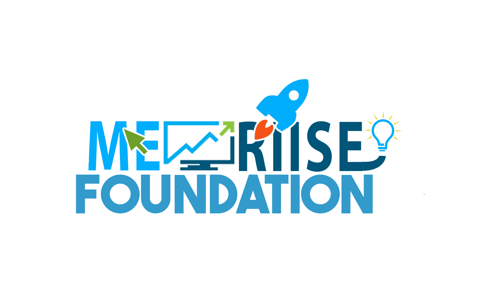

# 🚀 MERIISE Hiring App 2025 - Where Innovation Goes BOOM! 💥

Hey there! Welcome to the **ultimate hiring portal** for **ME-RIISE** - you know, the Malnad Enclave for Research, Innovation, Incubation, Startups and Entrepreneurship! We're not your average college thing; we're this **full-blown innovation powerhouse** that's about to make entrepreneurship explode! 💣🔥

## What the Heck is This?

So, this sleek React app is basically your ticket to joining the **Meriise Family** for 2025. It's like a **professional interview simulator** mixed with a **Pokemon evolution quest** - kinda fun, right? You can apply to all sorts of domains like Digital, Technical, Creative, Editorial, Startup & Research, Event Organizing, or even "Feeling Lost?" (yeah, we totally get it, life's confusing sometimes).

But here's the thing - we're not just any org. While some folks are out there doing their usual stuff, **Meriise is BUILDING THE FUTURE!** We're incubating startups, throwing hackathons, teaming up with the Ministry of Education, and turning college kids into these entrepreneurial ninjas. Our events like **Pragyatha**? They're legendary - imagine Shark Tank but with TED Talks vibes, way more innovation, and zero awkward silence.

## Why Pokemon? Because We're All Kids at Heart! 🎮

Okay, real talk: We picked this Pokemon theme to **attract the coolest people** - and let's be honest, most of us in college are obsessed with Pokemon! From Pikachu to Charizard, it just makes everything way more fun and relatable. We poured our hearts into the UX and UI, making it smooth, engaging, and super nostalgic so you feel right at home while leveling up your skills. It's not just eye candy; it's about that community vibe where everyone can chill, connect, and have an absolute blast. Honestly, we're the best at turning innovation into this epic adventure! 😎

## Why Join Meriise? Because We're Basically Superheroes 🦸‍♂️

Look, here's why you should totally give this a shot:

- **Innovation Incubation**: We don't just chat about ideas; we **actually build them**. Apps, automations, the works - we're legit.
- **Skill-Building Bonanza**: Pick up Python, React, design, writing, event planning - stuff that matters in the real world, you know?
- **Startup Vibes**: Pitch your wild ideas, prototype stuff, network with pros. Your next big thing could start right here.
- **Pokemon Evolution Theme**: Who doesn't love evolving from Charmander to Charizard? (Fine, we borrowed it from Nintendo, but it's awesome!)
- **Impact**: Your stuff isn't just for kicks - it helps students, boosts startups, and changes the region for the better.

## The Secret Sauce: Priority Cards & First Impressions 🎴

This website? It's not just some boring form—it's built to **blow your mind** and get you excited about Meriise. Finish the whole thing, and boom! You snag a **priority card** that bumps you to the front of the interview line. It's our little way of saying, "Hey, you put in the effort to check us out—let's get you noticed ASAP!" No more hanging back; this is your fast pass to the fun.

## Tech Stack

- **Frontend**: React + Vite (keeps it speedy)
- **Styling**: Tailwind CSS (super clean)
- **Hosting**: Vercel and Firebase (we scale big)
- **Pokemon Assets**: Borrowed from the web (don't tell Nintendo 😉)

## How to Run This Bad Boy

1. Grab the repo: `git clone https://github.com/pgyunknown/hiring2k25.git`
2. Get the deps: `npm install`
3. Fire up the dev server: `npm run dev`
4. Hit your browser and dive in!

## Contributing 🤝

Got some wild ideas? Wanna make Meriise even more epic? Fork it, send a PR, and let's build something insane together!

## Contact Us 📧

- Website: [meriise.org](https://meriise.org)
- Email: [ceomeriise@mcehassan.ac.in](mailto:ceomeriise@mcehassan.ac.in)
- Instagram: [@me_riise](https://www.instagram.com/me_riise/)
- Location: Malnad College of Engineering, Hassan, Karnataka

**Ready to evolve? Jump in now and let's make your career go BOOM!** 🚀💥

## Contributors 🧑‍💻🎨

### Coded by

  
**Max!!**

  
**PGY**

### Designed by

  
**Bilvatej**

  
**Kishan**

*Disclaimer: No real explosions here, but innovation? It's blowing up everywhere.*
